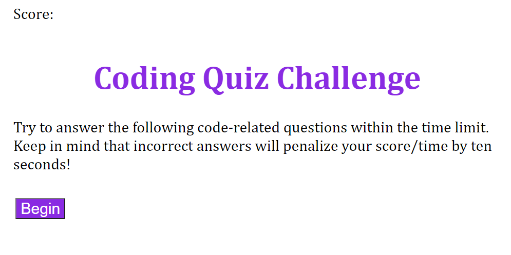

# Javascript-Quiz

https://kristenpicard.github.io/Javascript-Quiz/

## Description 

In this project I created a quiz about JavaScript.  
This quiz gives you 60 seconds to finish all of the 6 questions.  
If the player gets a question wrong, it takes 10 seconds off the timer.
If the player gets the question correct, it continues to the next question.
The player's score at the end is the amount of time left on the timer.
After the player finishes the quiz they are prompted to enter their initials and hit enter to be added to the high scores list.
This score is displayed in the high scores screen where they can view previous player's scores.
There is functionality to clear the high scores and go back to the beginning of the quiz.

Here is the beginning page of the quiz:
 

